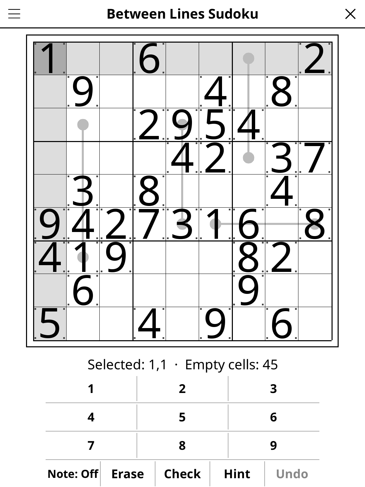

# betweenlines.koplugin

A Between Lines Sudoku plugin for [KOReader](https://github.com/koreader/koreader).

## Screenshot

## Rules

Standard 9×9 Sudoku rules (fill 1–9; no repeats in rows, columns, or 3×3 boxes) plus **between-lines constraints**: every digit on a line connecting two circle endpoints must be strictly between (numerically) the values of those two circles.

## Features

- **Four difficulty levels** — Easy, Medium, Hard and Expert, each guaranteeing the grid is solvable by pure deduction with no guessing
- **Line highlighting** — active lines are highlighted
- **Note mode** — pencil in candidate digits
- **Check** — highlights incorrect cells
- **Hint** — reveals the next deduction in three taps: where to look, which technique and digit, then the value itself
- **Reveal solution** — shows the full solution
- **Undo** — step back through your moves
- **Auto-save** — game state saved and restored on next launch

## Installation

1. Download `betweenlines.koplugin.zip` from the [latest release](../../releases/latest).
2. Extract into the `plugins/` folder of your KOReader data directory.
3. Restart KOReader.
4. Open the menu → **Tools** → **Between Lines Sudoku**.

## Controls

| Action | How |
|--------|-----|
| Select a cell | Tap it |
| Enter a digit | Tap the digit button |
| Erase a cell | Tap **Erase** |
| Toggle note mode | Tap **Note: Off / On** |
| Undo last move | Tap **Undo** |
| Check progress | Tap **Check** |
| Get a hint | Tap **Hint** (tap again to go deeper) |
| New game | Tap **New game** |
| Show rules | Tap **Rules** |

## License

GPL-3.0 — see [LICENSE](LICENSE).
